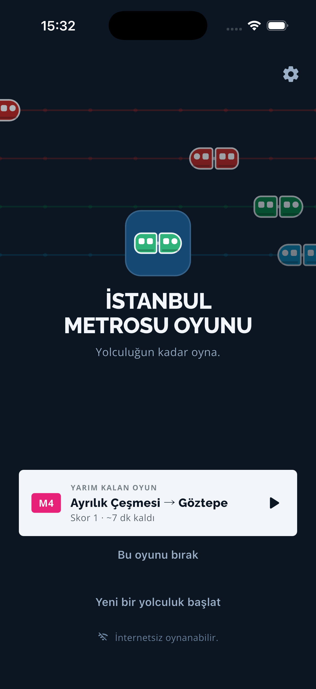
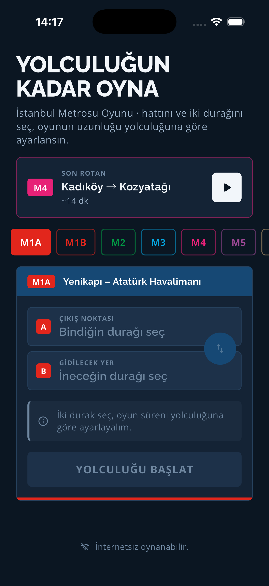
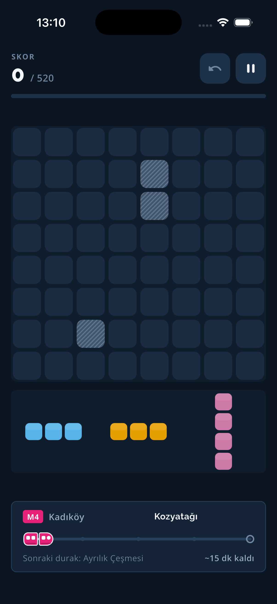
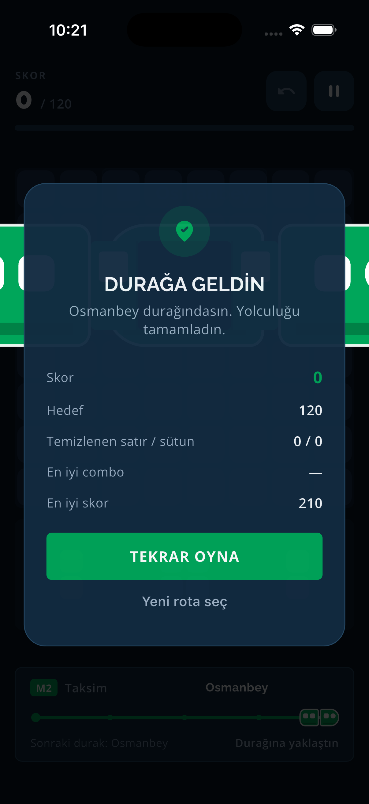

# İstanbul Metrosu Oyunu

> **Yolculuğun kadar oyna.**

İstanbul metrosunda internet zayıf ya da yokken oynanmak üzere tasarlanmış,
**tamamen offline** çalışan bir blok yerleştirme oyunu. Oyuncu bindiği ve
ineceği durağı seçer; uygulama tahmini yolculuk süresini hesaplar ve oyunun
hedefini/zorluğunu bu süreye göre ayarlar.

Bu depo, tasarım notlarındaki **MVP vertical slice**'ıdır (`01 - MVP.md`).

| Açılış | Yolculuk kurulumu | Oyun | Varış |
|---|---|---|---|
|  |  |  |  |

---

## Hızlı Başlangıç

```bash
flutter pub get
```

```bash
flutter run -d iphone
```

Testler:

```bash
flutter test
```

Analiz ve format:

```bash
flutter analyze && dart format lib test
```

**Gereksinimler:** Flutter 3.44+ (Dart 3.12+), iOS için Xcode ve CocoaPods.

---

## Metro Ağı

Uygulamada **10 metro hattı, 161 istasyon** var. MVP'de her hat **bağımsız
oynanır** — aktarma ve yürüme mesafesi kapsam dışı.

| Hat | Güzergâh | Durak | Tek yön |
|---|---|---:|---:|
| M1A | Yenikapı – Atatürk Havalimanı | 18 | 35 dk |
| M1B | Yenikapı – Kirazlı | 13 | 25 dk |
| M2 | Yenikapı – Hacıosman | 15 | 32 dk |
| M3 | Bakırköy – Kayaşehir | 20 | 44 dk |
| M4 | Kadıköy – Sabiha Gökçen Havalimanı | 23 | 52 dk |
| M5 | Üsküdar – Sultanbeyli | 24 | 50 dk |
| M6 | Levent – Boğaziçi Ü./Hisarüstü | 4 | 7 dk |
| M7 | Yıldız – Mahmutbey | 17 | 36 dk |
| M8 | Bostancı – Parseller | 13 | 26 dk |
| M9 | Ataköy – Olimpiyat | 14 | 26 dk |

**Veri kaynağı:** istasyon sırası ve resmi tek yön sefer süresi
metro.istanbul hat sayfalarından; hat renkleri resmi ağ haritasından.
Durak arası süreler, resmi sefer süresinin durak sayısına bölünmesiyle
türetilmiştir — kenar bazında resmi veri yayınlanmıyor. Bu yüzden her hattın
kendi ritmi var (M9'da 120 sn, M4'te 142 sn), tek tip "2 dakika" varsayımı
yok.

Veri tek dosyada: [`assets/data/metro.json`](assets/data/metro.json).
Yazılımcı olmayan biri de düzenleyebilir; kod değişmeden hat eklenebilir.

---

## Ekranlar

1. **Açılış** — arka planda hatlar kendi renklerinde akar, trenler raylarda
   ilerler. Birincil buton duruma göre değişir:
   **yarım kalan oyun varsa ona devam eder**, yoksa son oynanan rotayı tekrar
   oynatır, o da yoksa planlayıcıya götürür.
2. **Planlayıcı** — hat seçici + A/B çıkış/varış + süre ve rota rekoru.
3. **Oyun** — 8x8 tahta, üç parçalık tepsi, altta metro ilerlemesi.
4. **Ayarlar** — ses, titreşim, rota rekorları (sıfırlanabilir), veri ve
   lisans bilgisi. Açılış ekranından, planlayıcıdan ve oyun içindeki
   duraklatma panelinden açılır.

İlk açılışta üç kartlık bir tanıtım çıkar ve bir daha görünmez.

### Yarım kalan oyun

Metroda uygulama sürekli arka plana atılır: telefon cebe girer, ekran
kilitlenir, bildirim gelir. Bu yüzden oyun her hamlede ve her duraklatmada
diske yazılır. Uygulama tamamen kapatılsa bile açılışta **"Yarım kalan
oyun"** kartı çıkar; tahta, skor, tepsi ve geçen süre olduğu gibi geri
gelir. Oyun daima **duraklatılmış** açılır — kullanıcı hazır olduğunda
"Devam et" der. Yolculuk bitince kayıt silinir.

---

## Ses

Altı kısa arayüz sesi (`assets/audio/`) **sentezlenerek üretildi** — telif
sorunu olmayan, ürüne özgü basit tonlar. Yerleştirme, hat temizleme, combo,
durak bonusu, varış ve geçersiz hamle.

İki ürün kararı:

- **Kullanıcının müziğini kesmez.** iOS ses oturumu `ambient` +
  `mixWithOthers`; metroda kulaklıkla müzik dinleyen biri için şart.
- **Varsayılan olarak kapalı.** Kulaklıksız bir vagonda telefonun ötmesi
  istenmez; açmak ayarlardan.

Daha zengin ses isteniyorsa dosyalar aynı adlarla değiştirilebilir; kod
değişmez.

---

## Tasarım Dili

Arayüz, İstanbul metrosunun kendi dijital arayüzüne yaslanır:

- **Tipografi:** başlıklarda **Raleway**, gövde ve butonlarda **Open Sans** —
  metro.istanbul ile aynı aile. İkisi de SIL Open Font License 1.1 altındadır;
  statik ağırlıklar `google/fonts` değişken fontlarından üretilip latin +
  latin-ext karakter kümesine daraltıldı (`assets/fonts/`). Lisans metinleri
  uygulamanın "Lisanslar" ekranına kaydedilir.
- **Yolculuk planlayıcı:** ana ekran, resmi sitedeki "nasıl giderim"
  kutusunun düzenini izler — lacivert başlık şeridi, **A/B** işaretli
  *Çıkış Noktası* / *Gidilecek Yer* alanları, tam genişlik aksiyon butonu ve
  altta kırmızı vurgu şeridi.
- **Renk hiyerarşisi:** her rengin tek bir işi var.

  | Katman | Rol | Davranış |
  |---|---|---|
  | Nötr lacivert skalası | zemin, yüzey, kenarlık | sabit |
  | Aksiyon (`#F2F6FA`) | birincil buton | **sabit** — hatla değişmez |
  | Hat rengi | kimlik: rozet, tren, ray, ilerleme | hatla değişir |
  | `danger` | yalnız hata ve geçersiz hamle | sabit |
  | Blok renkleri | oyun tahtası | sabit, tüm hatlarda aynı |

  En önemli kural: **hat rengi aksiyon rengi değildir.** Buton her hatta aynı
  kalır, yoksa hiyerarşi kaybolur. Bloklar da hattan bağımsız — aksi hâlde
  renk körlüğü ayarını her hat için ayrı yapmak gerekirdi.

  Resmi hat renkleri arayüz için tasarlanmadı: M5 (`#693064`) koyu zeminde
  görünmüyor, M9 (`#FFD300`) üstünde beyaz metin okunmuyor. `LineTheme`
  resmi rengi kimlik olarak korur, kullanım yerine göre kontrast düzeltilmiş
  varyantını üretir.

  Blok paleti **Okabe–Ito** renk körlüğü güvenli setinden, metro palet
  ailesine en yakın beş ton seçilerek kuruldu.
- **Türkçe:** büyük harf dönüşümü locale-duyarlıdır
  (`Formatters.upperTr`: `i → İ`, `ı → I`). Durak araması da Türkçe
  karakterleri normalleştirir: "sisli" yazınca "Şişli" bulunur.
- **Erişilebilirlik:** kullanıcının yazı tipi ölçeği 1.6'ya kadar desteklenir
  (iOS'un "Büyük" kademeleri), ikon butonlarının semantik etiketi vardır ve
  "hareketi azalt" açıkken varış sahnesi oynatılmaz.

> Resmi logo, amblem veya marka görseli kullanılmaz; yalnızca açık lisanslı
> yazı tipleri ve arayüz düzeni referans alınır.
> TODO(PROD): Kurumsal renk/tipografi kullanımı için marka incelemesi.

---

## Oyun Kuralları

- 8x8 tahta.
- Oyuncuya aynı anda 3 parça verilir.
- Parça tahtaya sürükle-bırak ile konur; tüm hücreleri tahta içinde ve boş
  hücrelere denk gelmelidir.
- Yerleştirme sonrası **tamamen dolu satır ve sütunlar** aynı anda temizlenir.
- Skorlama:
  - yerleştirilen her hücre **+1**
  - temizlenen her satır **+10**, her sütun **+10**
  - aynı hamlede 2 hat **+30**, 3+ hat **+60** bonus
  - hat temizleyen ardışık hamleler combo yapar; **hat puanı** combo ile çarpılır
- Üç parça da kullanılınca yeni tepsi gelir. Parçalar **torbadan** çekilir:
  her şekil havuzdan çıkar, havuz bitince karıştırılıp yenilenir. Aynı
  tepside şekil tekrar etmez.
- Tepsideki hiçbir parça konamıyorsa oyun biter.
- Sayı birleştirme **yoktur** (2048 mekaniği değildir).

### Amaç: kendi rekorunu geç

Sabit hedef skor **yoktur**. Amaç, o rotada daha önce yaptığın en yüksek
skoru yolculuk bitmeden geçmektir. Rekor rota bazında tutulur — M4'te uçtan
uca kurulan rekor iki duraklık bir yolculuğu imkânsız kılmasın diye. Yön
rekoru bölmez: Taksim→Levent ile Levent→Taksim aynı rekoru paylaşır.

O rotada ilk yolculuksa kıyas yoktur; skorun rekor olur.

### Yolculuk oyunu etkiler

- **Durak bonusu:** tren bir durağı geçerken, o duraktan beri en az bir hat
  temizlediysen **+25**. İlerleme çubuğu dekorasyon olmaktan çıkar, her durak
  arası küçük bir hedef olur.
- **Son durak sprinti:** yolculuğun son %15'inde puanlar **iki katı**.

### Bitiş koşulları

Oyunun **tek finali varıştır**.

| Durum | Ne zaman | Sonuç |
|---|---|---|
| `arrived` | Tahmini yolculuk süresi dolar | Varış sahnesi: tren gelir, kapılar açılır, **"Durağa geldin"** — rota rekoru da geçildiyse ayrıca "Rekorunu geçtin" rozeti |
| `gameOver` | Legal hamle kalmaz | Tören yok, sade panel: "Hamle kalmadı" |

Rekoru yolculuk bitmeden geçmek oyunu **durdurmaz** — üstte kısa bir
"Rekoru geçtin" şeridi geçer, oyun kesintisiz devam eder.

---

## Yolculuk → Zorluk

Süre, uygulama paketine gömülü istasyon/kenar verisinden hesaplanır
(network yok, GPS yok).

| Profil | Süre | Başlangıç engeli | Zor parça | Undo |
|---|---:|---:|---:|---:|
| Mini | 0–5 dk | %0 | %5 | 1 |
| Kısa | 6–10 dk | %0 | %10 | 1 |
| Standart | 11–20 dk | %4 | %18 | 1 |
| Uzun | 21–35 dk | %8 | %25 | 0 |
| Maraton | 36+ dk | %12 | %32 | 0 |

Profil **hedef skor içermez**; yalnızca tahtanın ne kadar sıkışık
başladığını, hangi parçaların geldiğini ve geri alma hakkını belirler.
**Oyuncuya gösterilmez.**

Bu değerler prototip tuning değerleridir, nihai denge değildir:
[`lib/features/journey/models/difficulty_profile.dart`](lib/features/journey/models/difficulty_profile.dart)

### Metro ilerlemesi

```text
progress = aktifOyunSüresi / tahminiYolculukSüresi   // 0.0 – 1.0
```

**Konum izni istenmez.** Sayaç yalnızca oyun aktifken işler; uygulama arka
plana alınınca hem oyun hem sayaç durur.

---

## Mimari

Oyun kuralları Flutter widget'larından tamamen ayrıdır. `domain/` altındaki
fonksiyonlar saf ve test edilebilirdir; UI onları bilmez, sadece controller'ı
dinler.

```text
lib/
  app/            uygulama kabuğu, tema, rotalar, servis scope'u
  core/           sabitler, formatlayıcılar, local storage
  data/metro/     gömülü istasyon ve kenar verisi (değiştirilebilir katman)
  features/
    journey/      istasyon/rota modelleri, süre ve zorluk servisleri, home ekranı
    game/
      domain/     saf kurallar: board, piece, scoring, game_state
      application/game_controller, piece_generator
      presentation/oyun ekranı ve widget'ları
    progress/     metro ilerleme göstergesi
test/
  game/  journey/  widget/  helpers/
```

### Saf (test edilebilir) çekirdek

`lib/features/game/domain/board.dart`

- `canPlace` · `placePiece` · `findCompletedRows` · `findCompletedColumns`
- `clearLines` · `canPlaceAnywhere` · `findFirstLegalPosition` · `hasAnyLegalMove`

`lib/features/game/domain/scoring.dart` → `calculateScore`

`lib/features/journey/services/` → `RouteService.estimate` · `difficultyFor`

### Bağımlılıklar

Yalnızca `shared_preferences` (en iyi skor + haptic tercihi). Yazı tipleri
pakete gömülüdür — çalışma anında font indirilmez.
Firebase, analytics, reklam, login, cloud save, push ve API çağrısı
**bilinçli olarak yoktur** — MVP offline-first'tür.

---

## Test Kapsamı

100 test: board kuralları, parça geometrisi, skor/combo, game-over tespiti,
parça üretimi ve adalet (fairness) garantisi, rota süresi ve zorluk sınırları,
controller yaşam döngüsü, Türkçe biçimlendirme, home/oyun ekranı widget
testleri (en alt satıra bırakma regresyonu ve varış sahnesi dahil) ve
metro veri seti doğrulaması (hat sayısı, sıra bütünlüğü, uçtan uca sürenin
resmi sefer süresiyle uyumu), torba dağılımı, durak bonusu ve sprint.

```bash
flutter test
```

---

## Bilinen Sınırlar

Detaylı liste ve production TODO'ları: [HANDOFF.md](HANDOFF.md)

- **Aktarma yok:** iki durak aynı hatta olmalı. Aktarma ve yürüme mesafesi
  bilinçli olarak sonraki aşamaya bırakıldı.
- Durak arası süreler türetilmiştir; kenar bazında resmi veri yayınlanmıyor.
- **M11 (Gayrettepe – İstanbul Havalimanı – Halkalı) eklenmedi** — TCDD
  işletiyor ve metro.istanbul hat sayfalarında yayınlanmıyor, doğrulanmış
  istasyon/süre verisi bulunamadı.
- Resmi Metro İstanbul logosu/marka görseli kullanılmaz; tüm görseller özgün
  ve basit şekillerdir.
- Tek tema (koyu), yalnızca dikey yön.
- Yazı tipi ölçeği 1.6'da sınırlanır; tahta sabit oranlı olduğu için üstü
  test edilmedi.
- Tipografi ve renk düzeni resmi arayüzü referans alır; ticari yayın öncesi
  marka incelemesi gerekir.
- Ses efekti yoktur; haptic opsiyoneldir.
